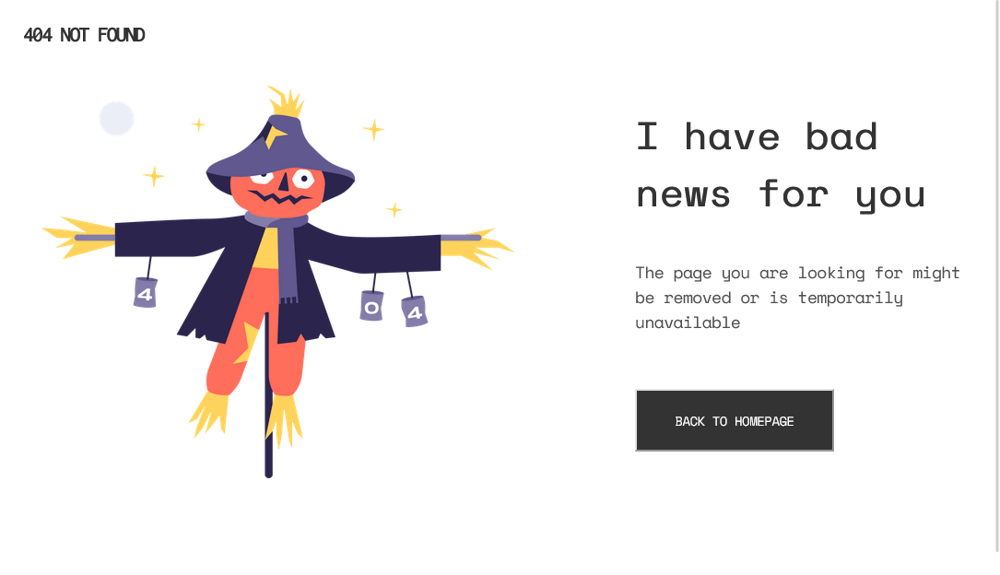

<!-- Please update value in the {}  -->

<h1 align="center">{404 NOT FOUND MASTER}</h1>

   Solution for a challenge from  <a href="http://devchallenges.io" target="_blank">Devchallenges.io</a>.

  <h3>
    <a href="https://gd-404notfoundmaster.netlify.app/">
      Demo
    </a>
     | 
    <a href="https://github.com/geovannydev/404-NOT-FOUND-MASTER">
      Solution
    </a>
     | 
    <a href="https://devchallenges.io/challenges/wBunSb7FPrIepJZAg0sY">
      Challenge
    </a>
  </h3>

<!-- OVERVIEW -->

## Overview

## Contact

- Website [geovannydev](https://geovannydev.me)
- GitHub [@geovannydev](https://github.com/geovannydev)
- Twitter [@geovannydev](https://twitter.com/geovannydev)
